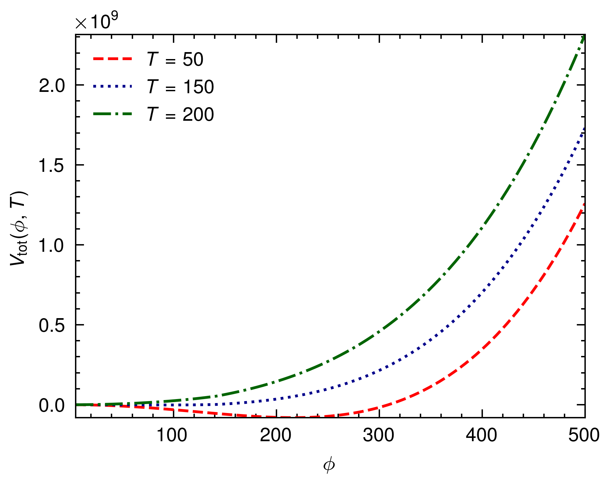

# Cosmo Transition

Cosmo Transition is a Rust project that calculates the one-loop thermal correction for the effective potential in a scalar field theory. This project is useful for studying phase transitions in the early universe, particularly in the context of cosmology.

## Features

- Calculates the tree-level potential (`V0`) and the one-loop correction (`V1loop`) for a given scalar field value (`phi_c`).
- Computes the thermal corrections to the one-loop potential (`V1loop_thermal`) at a given temperature (`T`).
- Provides functions to calculate the mass of the W and Z bosons (`m_W`, `m_Z`) and the top quark (`m_t`) as a function of the scalar field value.
- Utilizes the `peroxide`, `rayon`, and `indicatif` crates for efficient computation and progress tracking.
- Generates plots of the various potentials and thermal corrections using the `peroxide` plotting library.

## Installation

1. Make sure you have Rust installed on your system. If not, you can download and install it from the official Rust website: [https://www.rust-lang.org/](https://www.rust-lang.org/)

2. Clone this repository:
   ```
   git clone https://github.com/your-username/cosmo-transition.git
   ```

3. Change to the project directory:
   ```
   cd cosmo-transition
   ```

4. Build the project:
   ```
   cargo build --release
   ```

## Usage

To run the Cosmo Transition project, use the following command:

```
cargo run --release
```

This will execute the `main` function in `src/main.rs`, which performs the following steps:

1. Calculates the tree-level potential (`V0`), one-loop correction (`V1loop`), and the effective potential (`V_eff`) for a range of scalar field values (`phi_c`).
2. Computes the thermal corrections (`V1loop_thermal`) for a range of temperatures (`T`).
3. Generates plots of the various potentials and thermal corrections, saving them as PNG files in the project directory.

## Results

- One loop thermal corrections
  

- Total potential
  

## Contributing

Contributions to Cosmo Transition are welcome! If you find any issues or have suggestions for improvements, please open an issue or submit a pull request on the GitHub repository.

## License

This project is licensed under the [MIT License](LICENSE).

## Acknowledgments

- The `peroxide` crate for efficient computation and plotting.
- The `rayon` crate for parallel processing.
- The `indicatif` crate for progress tracking.
